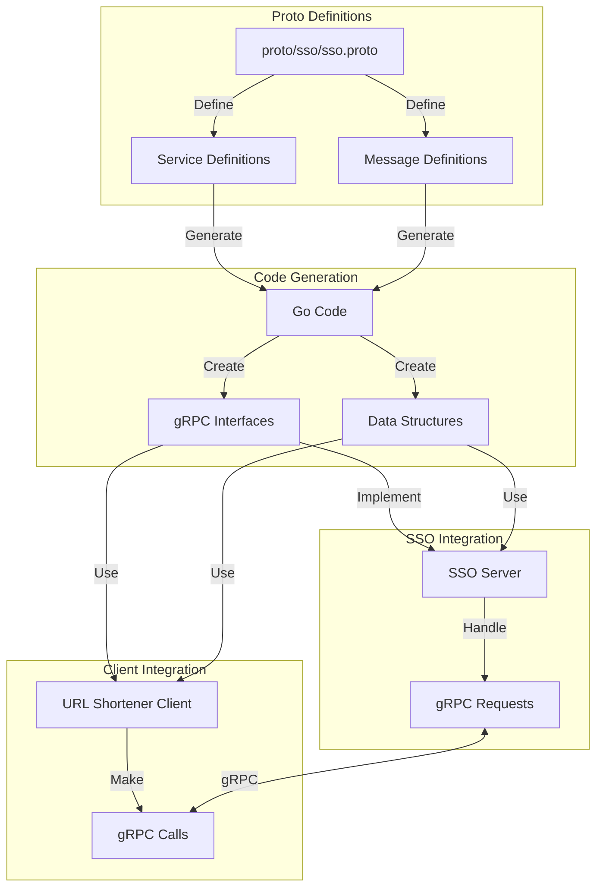

# Описание проекта Protos

Проект Protos представляет собой систему определения и генерации gRPC-контрактов, используемых для взаимодействия между сервисами в микросервисной архитектуре. Основой проекта является Protocol Buffers (protobuf) - язык описания интерфейсов и сериализации данных, разработанный Google.

В основе проекта лежит файл sso.proto, который определяет структуру сервиса аутентификации и авторизации. Этот файл описывает все методы, которые может вызывать клиент, а также структуры данных, используемые для передачи информации между сервисами. Определения включают в себя методы для регистрации пользователей, аутентификации, проверки прав доступа и выхода из системы.

Структура proto-файла организована логически, начиная с определения версии синтаксиса и пакета, затем описываются сервисы и их методы, а в конце определяются все необходимые сообщения. Каждое сообщение содержит поля с указанием их типов и уникальных номеров, что обеспечивает обратную совместимость при обновлении контрактов.

Генерация кода из proto-файлов происходит автоматически с помощью protoc компилятора. Сгенерированный код включает в себя структуры данных, интерфейсы сервисов и клиентов, а также все необходимые методы для сериализации и десериализации сообщений. Этот код используется как в сервисе SSO, так и в клиентских приложениях, таких как URL Shortener.

Процесс интеграции начинается с определения контрактов в proto-файле, которые затем компилируются в код Go. Сгенерированный код используется в SSO для реализации серверной части и в URL Shortener для создания клиента. Это обеспечивает типобезопасность и согласованность интерфейсов между сервисами.

В SSO сервисе сгенерированные интерфейсы реализуются в конкретных структурах, которые обрабатывают бизнес-логику аутентификации и авторизации. Клиентские приложения используют сгенерированный код для создания gRPC-клиентов, которые могут вызывать методы сервиса SSO.

Важной особенностью системы является версионирование контрактов. При внесении изменений в proto-файлы необходимо учитывать обратную совместимость, добавляя новые поля с новыми номерами, а не изменяя существующие. Это позволяет обновлять сервисы независимо друг от друга, не нарушая работу системы в целом.

Проект также включает в себя скрипты для автоматизации процесса генерации кода и управления версиями контрактов. Это упрощает процесс разработки и обеспечивает согласованность между различными частями системы. 