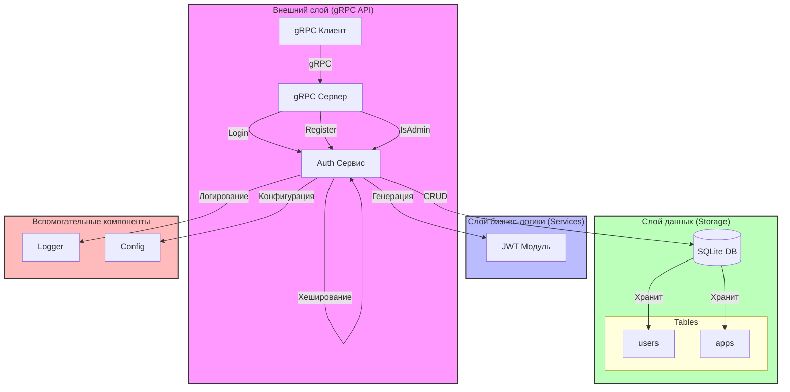

# Архитектура SSO

## Описание компонентов

### Внешний слой (gRPC API)
- **gRPC Клиент**: Внешние приложения, использующие SSO
- **gRPC Сервер**: Обработка входящих запросов и валидация данных

### Слой бизнес-логики (Services)
- **Auth Сервис**: Основная бизнес-логика аутентификации и авторизации
- **JWT Модуль**: Генерация и валидация токенов

### Слой данных (Storage)
- **SQLite DB**: Хранилище данных
- **Таблицы**:
  - `users`: Пользователи системы
  - `apps`: Зарегистрированные приложения

### Вспомогательные компоненты
- **Logger**: Логирование операций
- **Config**: Управление конфигурацией

## Процессы

### Аутентификация
1. Клиент отправляет запрос на Login
2. gRPC сервер валидирует данные
3. Auth сервис проверяет пользователя
4. Генерируется JWT токен
5. Токен возвращается клиенту

### Регистрация
1. Клиент отправляет запрос на Register
2. gRPC сервер валидирует данные
3. Auth сервис хеширует пароль
4. Данные сохраняются в SQLite
5. ID пользователя возвращается клиенту

### Проверка прав
1. Клиент отправляет запрос на IsAdmin
2. gRPC сервер валидирует данные
3. Проверяются права в SQLite
4. Результат возвращается клиенту 