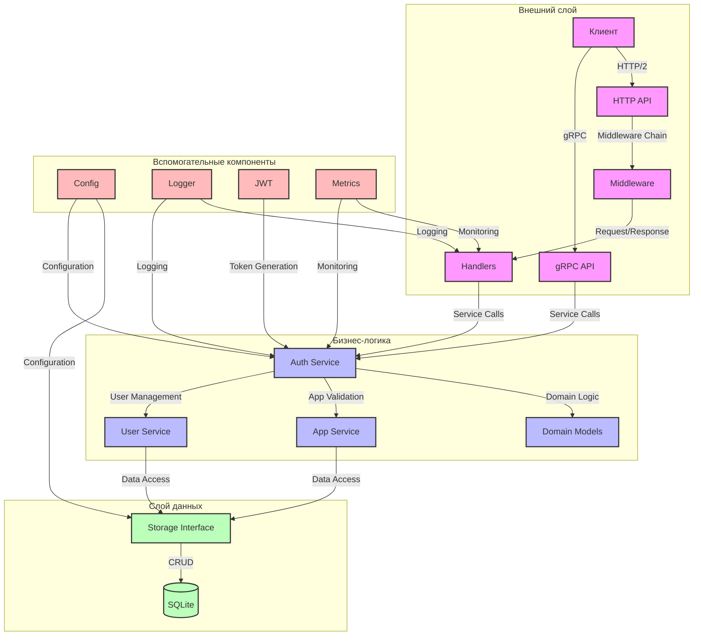

# Архитектура слоев SSO

## Схема слоев

## Описание слоев

### 1. Внешний слой (External Layer)
- **gRPC API**
  - Обработка gRPC запросов
  - Валидация входных данных
  - Сериализация/десериализация сообщений

- **HTTP API**
  - Обработка HTTP/2 запросов
  - RESTful API для аутентификации
  - Маршрутизация запросов

- **Middleware**
  - Аутентификация
  - Логирование
  - Метрики
  - Обработка ошибок
  - Rate limiting

- **Handlers**
  - Обработчики HTTP запросов
  - Преобразование HTTP в доменные модели
  - Валидация бизнес-правил

### 2. Бизнес-логика (Business Logic)
- **Auth Service**
  - Аутентификация пользователей
  - Генерация JWT токенов
  - Валидация токенов
  - Управление сессиями

- **User Service**
  - Управление пользователями
  - Регистрация
  - Проверка прав доступа
  - Управление профилями

- **App Service**
  - Управление приложениями
  - Валидация приложений
  - Управление разрешениями
  - Конфигурация приложений

- **Domain Models**
  - Бизнес-сущности (User, App, Token)
  - Валидация бизнес-правил
  - Доменные события

### 3. Слой данных (Data Layer)
- **Storage Interface**
  - Абстракция доступа к данным
  - Repository pattern
  - Unit of Work
  - Транзакции

- **SQLite**
  - Постоянное хранение данных
  - Транзакционность
  - Миграции схемы
  - Оптимизация запросов

### 4. Вспомогательные компоненты (Utilities)
- **Config**
  - Конфигурация приложения
  - Переменные окружения
  - Feature flags
  - Настройки компонентов

- **Logger**
  - Структурированное логирование
  - Уровни логирования
  - Контекст
  - Трассировка запросов

- **JWT**
  - Генерация токенов
  - Валидация токенов
  - Управление ключами
  - Обновление токенов

- **Metrics**
  - Prometheus метрики
  - Мониторинг
  - Трейсинг
  - Профилирование

## Принципы взаимодействия

1. **Зависимости направлены внутрь**
   - Внешний слой зависит от бизнес-логики
   - Бизнес-логика зависит от абстракций слоя данных
   - Вспомогательные компоненты доступны всем слоям

2. **Инверсия зависимостей**
   - Слои зависят от абстракций
   - Интерфейсы определяются потребителем
   - Внедрение зависимостей через конструкторы

3. **Чистая архитектура**
   - Разделение ответственности
   - Независимость от фреймворков
   - Тестируемость компонентов

## Преимущества архитектуры

1. **Масштабируемость**
   - Легко добавлять новые функции
   - Возможность горизонтального масштабирования
   - Независимость компонентов

2. **Поддерживаемость**
   - Четкое разделение ответственности
   - Легкость внесения изменений
   - Понятная структура кода

3. **Тестируемость**
   - Изолированные компоненты
   - Легкость написания unit-тестов
   - Возможность мокирования зависимостей

4. **Безопасность**
   - Контроль доступа на уровне middleware
   - Защита от перегрузок
   - Валидация на всех уровнях 