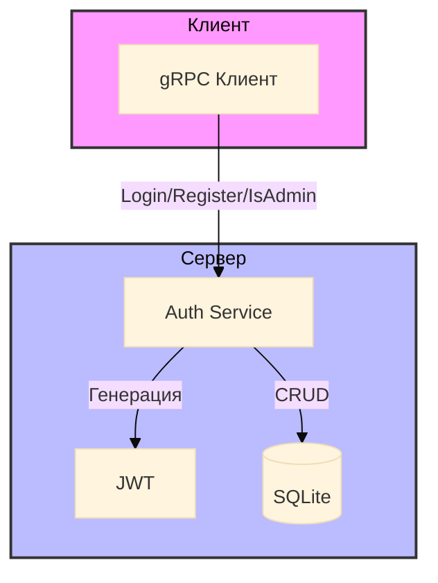

# Мини-схема архитектуры SSO

## Краткое описание

Система SSO построена на трех основных компонентах: клиент, сервер аутентификации и хранилище данных. Клиент взаимодействует с сервером через gRPC API, отправляя запросы на аутентификацию, регистрацию и проверку прав. Сервер обрабатывает эти запросы, используя JWT для генерации токенов и SQLite для хранения данных. Вся система построена с учетом принципов чистой архитектуры и безопасности. 