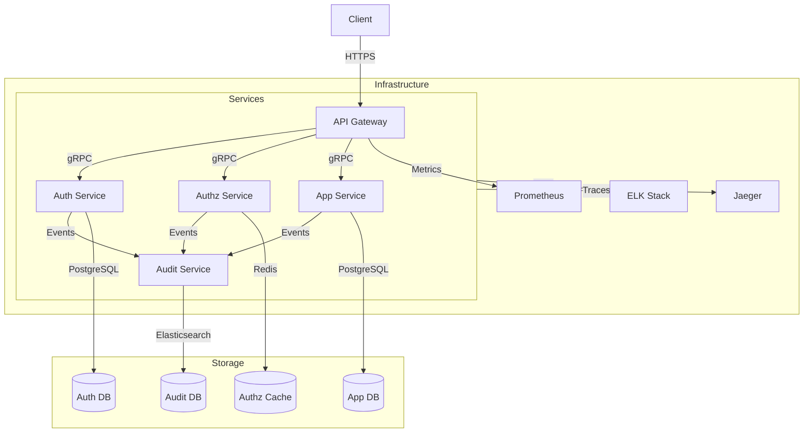

# Возможные пути масштабирования SSO

## Текущая архитектура и её ограничения

В текущей реализации SSO представляет собой монолитное приложение с единой базой данных SQLite. Это накладывает определенные ограничения на масштабируемость:
- SQLite не поддерживает параллельную запись
- Все компоненты системы тесно связаны
- Нет возможности независимого масштабирования отдельных частей
- Единая точка отказа

## Возможные пути разделения на микросервисы

### 1. Сервис аутентификации (Auth Service)
- Отвечает за регистрацию и аутентификацию пользователей
- Управляет JWT-токенами
- Хранит учетные данные пользователей
- Использует PostgreSQL вместо SQLite для лучшей поддержки параллельных запросов
- Может масштабироваться горизонтально

### 2. Сервис авторизации (Authz Service)
- Проверяет права доступа пользователей
- Управляет ролями и разрешениями
- Кэширует результаты проверок в Redis
- Может работать независимо от сервиса аутентификации
- Легко масштабируется при росте нагрузки

### 3. Сервис управления приложениями (App Service)
- Управляет регистрацией и настройкой приложений
- Хранит конфигурации OAuth
- Отвечает за валидацию токенов приложений
- Может иметь свою базу данных
- Независим от других сервисов

### 4. API Gateway
- Единая точка входа для всех клиентов
- Маршрутизация запросов к соответствующим сервисам
- Балансировка нагрузки
- Кэширование и rate limiting
- SSL/TLS терминация

### 5. Сервис аудита (Audit Service)
- Логирование всех действий пользователей
- Отслеживание попыток входа
- Анализ безопасности
- Может использовать специализированные хранилища для логов

## Преимущества такого разделения

1. **Независимое масштабирование**
   - Каждый сервис может масштабироваться независимо
   - Возможность горизонтального масштабирования
   - Оптимизация ресурсов

2. **Улучшенная отказоустойчивость**
   - Отсутствие единой точки отказа
   - Возможность частичного восстановления
   - Изоляция проблем

3. **Технологическая гибкость**
   - Возможность использовать разные базы данных
   - Выбор оптимальных технологий для каждого сервиса
   - Независимое обновление компонентов

4. **Улучшенная безопасность**
   - Изоляция чувствительных данных
   - Более тонкий контроль доступа
   - Возможность специализированной защиты

## Необходимые изменения

1. **Инфраструктура**
   - Внедрение контейнеризации (Docker)
   - Оркестрация (Kubernetes)
   - Service Mesh (например, Istio)
   - Мониторинг и логирование

2. **Архитектура**
   - Переход на event-driven архитектуру
   - Внедрение message broker (например, RabbitMQ)
   - Реализация circuit breaker
   - Кэширование на разных уровнях

3. **Безопасность**
   - Внедрение API Gateway
   - Усиление аутентификации между сервисами
   - Мониторинг безопасности
   - Управление секретами

4. **Данные**
   - Разделение баз данных
   - Репликация данных
   - Синхронизация между сервисами
   - Управление миграциями

## Пример взаимодействия

## Этапы миграции

1. **Подготовительный этап**
   - Анализ текущей нагрузки
   - Определение узких мест
   - Планирование архитектуры
   - Подготовка инфраструктуры

2. **Постепенное разделение**
   - Выделение сервиса аутентификации
   - Добавление API Gateway
   - Миграция на PostgreSQL
   - Внедрение мониторинга

3. **Расширение функциональности**
   - Добавление сервиса авторизации
   - Внедрение кэширования
   - Добавление сервиса аудита
   - Улучшение безопасности

4. **Оптимизация**
   - Настройка балансировки нагрузки
   - Оптимизация производительности
   - Улучшение мониторинга
   - Автоматизация операций 