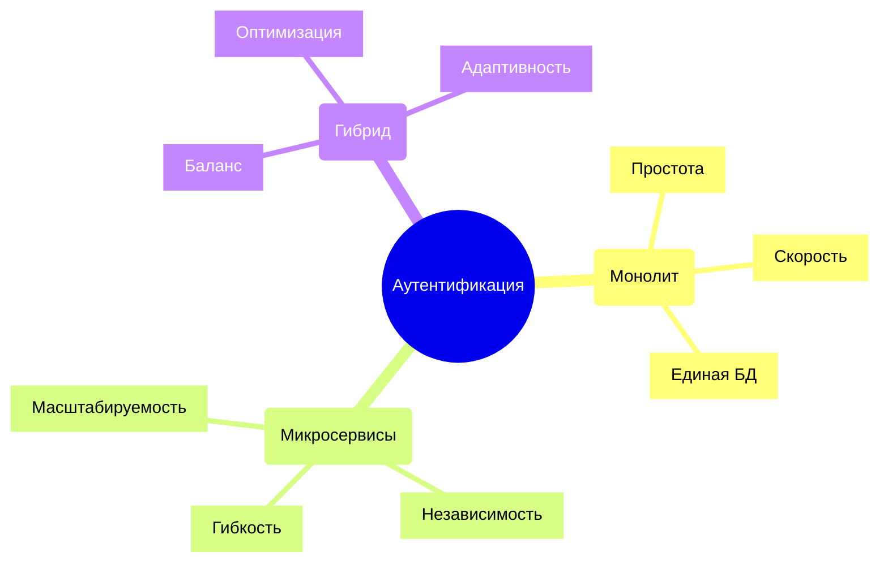
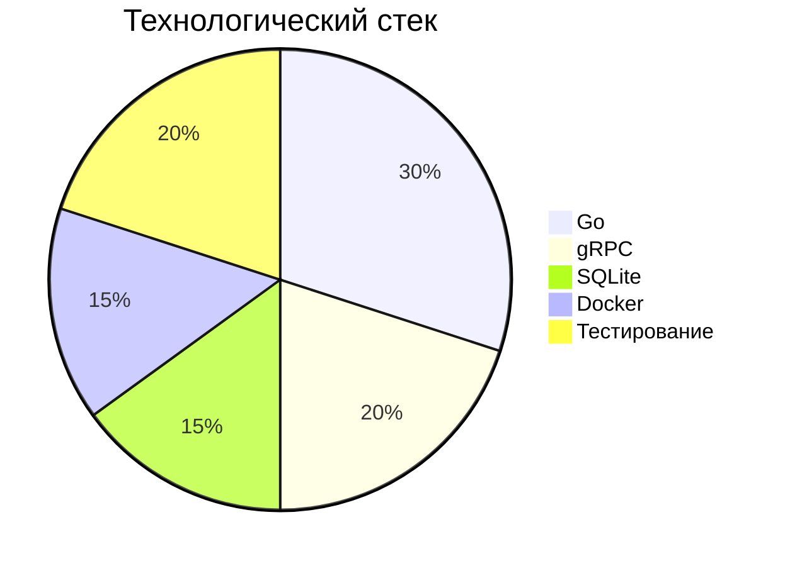
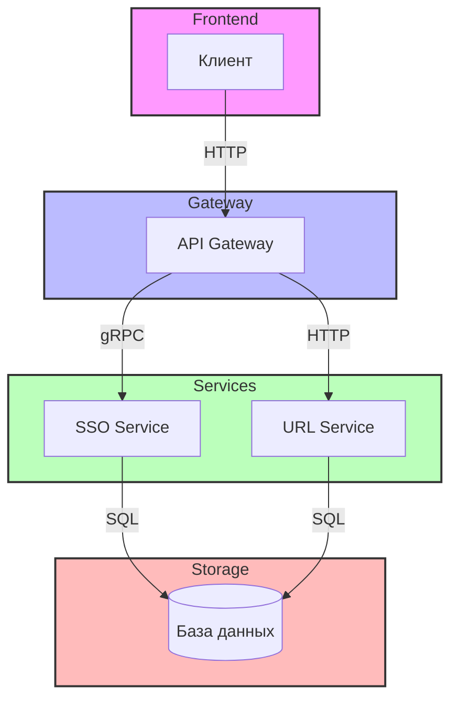
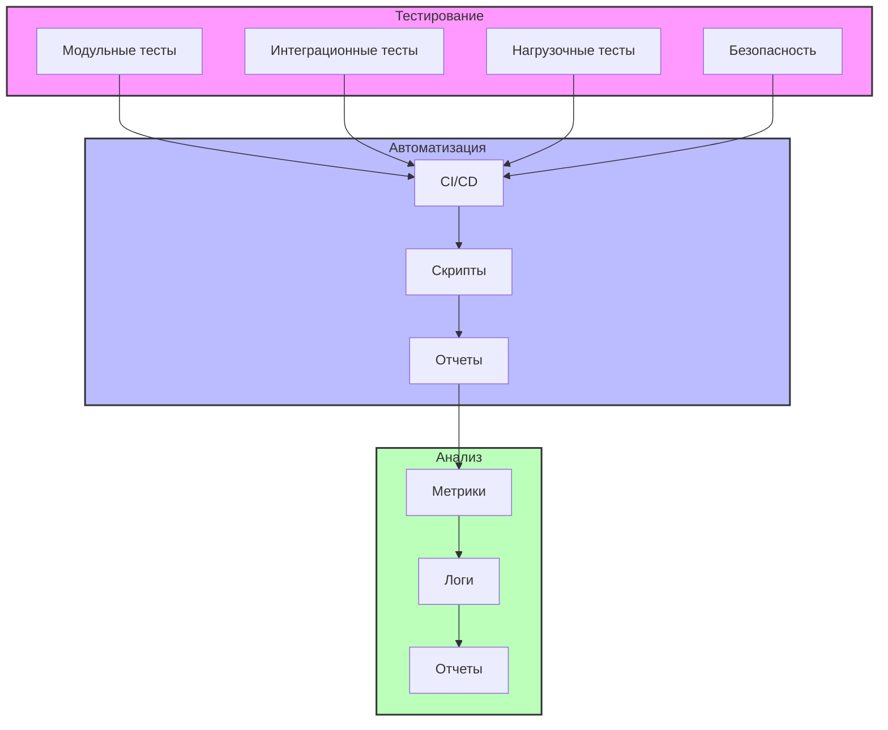
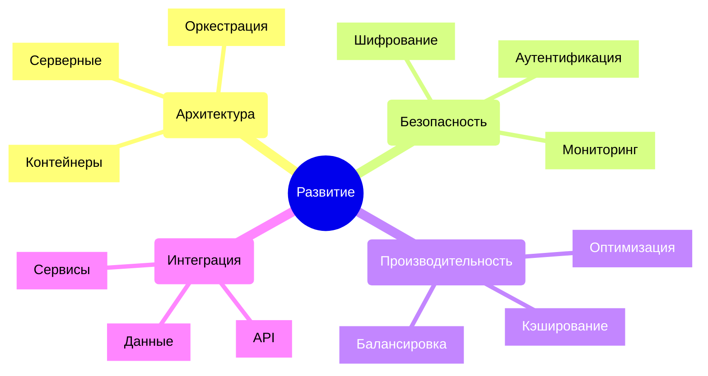

# Теоретические схемы

## Раздел 1: Анализ предметной области



## Раздел 2: Технологии и инструменты



## Раздел 3: Архитектурные решения



## Раздел 4: Безопасность

```mermaid
graph LR
    subgraph Внешний слой
        A[Firewall]
        B[WAF]
    end
    
    subgraph Аутентификация
        C[JWT]
        D[2FA]
    end
    
    subgraph Авторизация
        E[RBAC]
        F[ACL]
    end
    
    subgraph Защита данных
        G[Шифрование]
        H[HTTPS]
    end
    
    A --> B
    B --> C
    C --> D
    D --> E
    E --> F
    F --> G
    G --> H
    
    style Внешний слой fill:#f96,stroke:#333,stroke-width:2px
    style Аутентификация fill:#9f6,stroke:#333,stroke-width:2px
    style Авторизация fill:#69f,stroke:#333,stroke-width:2px
    style Защита данных fill:#f69,stroke:#333,stroke-width:2px
```

## Раздел 6: Тестирование



## Раздел 8: Перспективы развития



## Описание схем

Каждая схема представляет собой уникальное визуальное представление различных аспектов системы:

### Раздел 1: Анализ предметной области
Использует mindmap для отображения различных подходов к аутентификации и их характеристик.

### Раздел 2: Технологии и инструменты
Представлен в виде круговой диаграммы, показывающей распределение технологий в проекте.

### Раздел 3: Архитектурные решения
Использует flowchart с подграфами для визуализации различных слоев системы.

### Раздел 4: Безопасность
Представлен в виде графа с подграфами, показывающими слои безопасности.

### Раздел 6: Тестирование
Использует направленный граф с подграфами для отображения процесса тестирования.

### Раздел 8: Перспективы развития
Использует mindmap для отображения возможных направлений развития системы. 