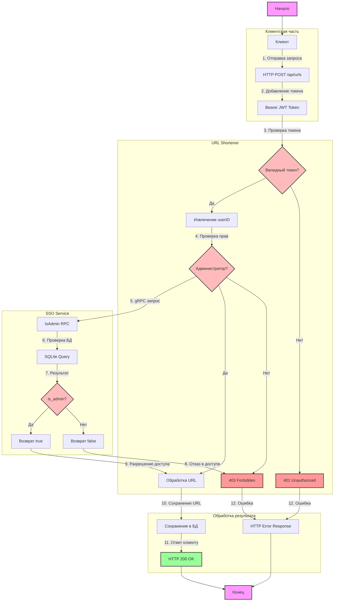

# Логика работы приложения SSO + URL Shortener

## Описание логики работы

1. **Инициация запроса**
   - Клиент формирует HTTP POST запрос
   - Добавляет JWT токен в заголовок Authorization

2. **Проверка токена**
   - URL Shortener проверяет наличие токена
   - Валидирует JWT токен
   - При ошибке возвращает 401 Unauthorized

3. **Извлечение данных**
   - Из токена извлекается userID
   - Подготавливается запрос к SSO

4. **Проверка прав**
   - URL Shortener отправляет gRPC запрос к SSO
   - SSO проверяет права в базе данных
   - При отсутствии прав возвращает 403 Forbidden

5. **Обработка URL**
   - При успешной проверке прав обрабатывается URL
   - URL сохраняется в базе данных
   - Возвращается успешный ответ клиенту

6. **Обработка ошибок**
   - Все ошибки логируются
   - Клиент получает понятное сообщение об ошибке
   - Сохраняется консистентность данных 