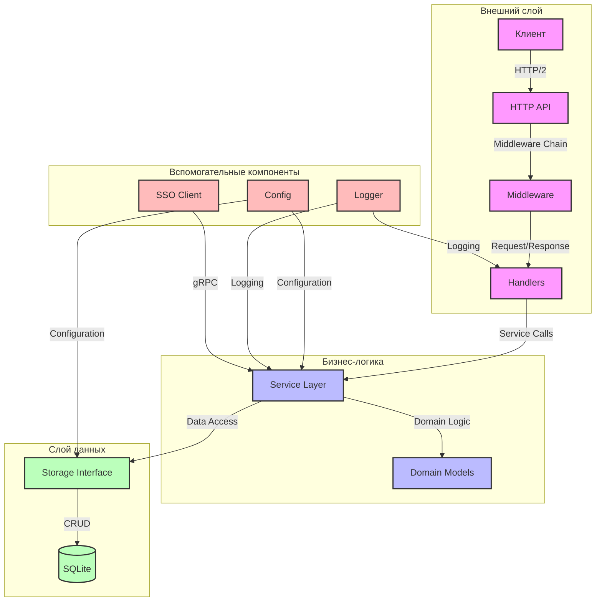

# Архитектура слоев URL Shortener

## Схема слоев

## Описание слоев

### 1. Внешний слой (External Layer)
- **Клиент**: Внешние HTTP-клиенты
- **HTTP API**: REST API на базе Chi Router
- **Middleware**: 
  - RequestID для трассировки
  - Logger для логирования
  - Recoverer для обработки паник
  - URLFormat для нормализации URL
  - BasicAuth для аутентификации

- **Handlers**: Обработчики HTTP-запросов для создания и перенаправления ссылок

### 2. Бизнес-логика (Business Logic)
- **Service Layer**: Сервисный слой с основной бизнес-логикой
- **Domain Models**: Модели данных и бизнес-правила

### 3. Слой данных (Data Layer)
- **Storage Interface**: Интерфейс для работы с хранилищем
- **SQLite**: База данных SQLite для хранения URL и алиасов

### 4. Вспомогательные компоненты (Utilities)
- **Config**: Конфигурация приложения через YAML
- **Logger**: Система логирования на базе slog
- **SSO Client**: gRPC-клиент для интеграции с SSO-сервисом

## Принципы взаимодействия

1. **Зависимости направлены внутрь**
   - Внешний слой зависит от бизнес-логики
   - Бизнес-логика зависит от интерфейсов слоя данных
   - Слой данных не зависит от других слоев

2. **Инверсия зависимостей**
   - Использование интерфейсов для абстракции
   - Внедрение зависимостей через конструкторы
   - Модульность и тестируемость компонентов

3. **Чистая архитектура**
   - Разделение на слои
   - Независимость от фреймворков
   - Тестируемость каждого слоя
   - Простота поддержки и модификации 